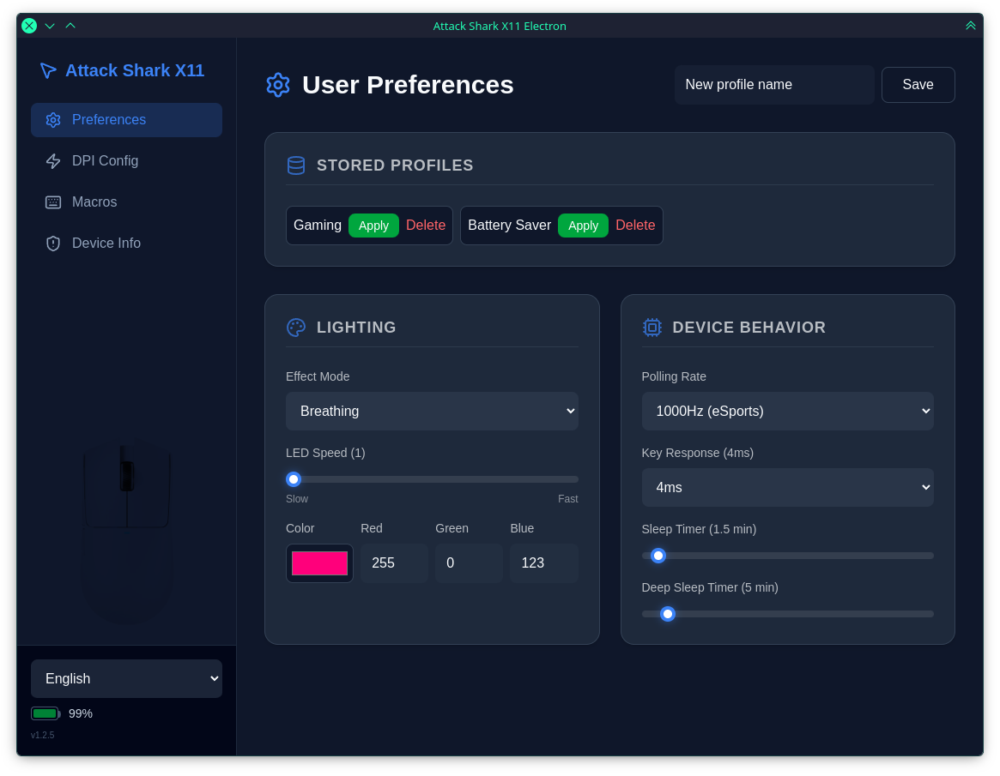

# attack-shark-x11-electron



[](https://www.npmjs.com/package/attack-shark-x11-driver)
[](https://github.com/HarukaYamamoto0/attack-shark-x11-driver/blob/main/LICENSE)
[](https://bun.sh)

A cross-platform desktop app to configure your **Attack Shark X11** gaming mouse — DPI, macros, lighting, polling rate, and more. Built with Electron + Vue 3.

Fork of [HarukaYamamoto0's driver](https://github.com/HarukaYamamoto0) with a new GUI and extended features.

---

## Quick Install

```bash
# Arch Linux (AUR)
yay -S attack-shark-x11-electron

# Other Linux: download from Releases
```

Grab the latest `.AppImage` or `.deb` from the [Releases page](https://github.com/dressedinblack5/attack-shark-x11-electron/releases).

---

## Features

**Device control** — DPI stages, button remapping, macros with timing, lighting (mode/speed/color), polling rate (125–1000 Hz), battery monitoring, device reset.

**App features** — Dark/Light/Cappuccino themes, i18n (EN/ES), auto-save, full config persistence across restarts, type-safe settings loading.

**Platform** — Linux, macOS, Windows. 132 tests across 13 files.

**USB Stack** — Fully migrated from `usb` v2 (node-usb, synchronous Transfer API) to `usb` v3 (node-usb-rs, async WebUSB API). Battery monitoring uses interrupt endpoint polling via `nativeTransferIn`. Upstream bug fix submitted (node-usb-rs#4).

---

## Linux Setup (udev)

The mouse needs a udev rule so the app can access it without `sudo`:

```bash
# 1. Create the rule file
sudo tee /etc/udev/rules.d/99-attack-shark-x11.rules > /dev/null <<'UDEV'
SUBSYSTEM=="usb", ATTR{idVendor}=="1d57", ATTR{idProduct}=="fa60", MODE="0666", GROUP="plugdev"
SUBSYSTEM=="usb", ATTR{idVendor}=="1d57", ATTR{idProduct}=="fa55", MODE="0666", GROUP="plugdev"
UDEV

# 2. Reload rules
sudo udevadm control --reload-rules && sudo udevadm trigger
```

---

## Build from Source

Prerequisite: [Bun](https://bun.sh/)

```bash
git clone https://github.com/dressedinblack5/attack-shark-x11-electron.git
cd attack-shark-x11-electron
bun install
bun run package     # outputs to ./dist
```

```bash
bun test            # 137 tests
```

---

## Device Specs

| | |
|---|---|
| **Sensor** | PixArt PAW3311 |
| **Max DPI** | 22,000 (6 levels) |
| **Polling Rate** | 125–1000 Hz |
| **Weight** | ~63g |
| **Battery** | Up to 65 hrs / 2–3 hr charge |
| **Connectivity** | Wired + 2.4GHz wireless (Bluetooth untested) |
| **Vendor / Product** | `0x1d57` / `0xfa60` (wireless), `0xfa55` (wired) |

---

## Supported Hardware

| Device | Mode | Status |
|---|---|---|
| Attack Shark X11 | Wired | ✅ Supported |
| Attack Shark X11 | 2.4GHz wireless | ✅ Supported |
| Attack Shark X11 | Bluetooth | ❓ Not tested |
| Attack Shark R1 | — | ❓ Not verified |

---

## Contributing

Reverse-engineering effort. PRs welcome for protocol docs, features, or hardware testing. See `docs/` for packet analysis.

---

## License

MIT © [HarukaYamamoto0](https://github.com/HarukaYamamoto0)

*Not affiliated with Attack Shark. Use at your own risk.*
